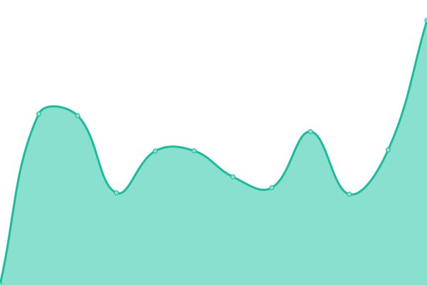

# [📈 Live Status](https://naffiq.github.io/emdey-uptime): <!--live status--> **🟧 Partial outage**

This repository contains the open-source uptime monitor and status page for [Galymzhan Abdugalimov](https://naffiq.com), powered by [Upptime](https://github.com/upptime/upptime).

With [Upptime](https://upptime.js.org), you can get your own unlimited and free uptime monitor and status page, powered entirely by a GitHub repository. We use [Issues](https://github.com/naffiq/emdey-uptime/issues) as incident reports, [Actions](https://github.com/naffiq/emdey-uptime/actions) as uptime monitors, and [Pages](https://naffiq.github.io/emdey-uptime) for the status page.

<!--start: status pages-->
<!-- This summary is generated by Upptime (https://github.com/upptime/upptime) -->
<!-- Do not edit this manually, your changes will be overwritten -->
<!-- prettier-ignore -->
| URL | Status | History | Response Time | Uptime |
| --- | ------ | ------- | ------------- | ------ |
|  [Emdey](https://emdey.kz/) | 🟥 Down | [emdey.yml](https://github.com/naffiq/emdey-uptime/commits/HEAD/history/emdey.yml) | 

 1734ms
     
 | 

<a href="https://naffiq.github.io/emdey-uptime/history/emdey">99.98%</a>
    

|  [API Emdey](https://api.emdey.kz/) | 🟥 Down | [api-emdey.yml](https://github.com/naffiq/emdey-uptime/commits/HEAD/history/api-emdey.yml) | 

 1167ms
     
 | 

<a href="https://naffiq.github.io/emdey-uptime/history/api-emdey">99.68%</a>
    

|  [MIS Emdey](https://mis.emdey.kz/) | 🟥 Down | [mis-emdey.yml](https://github.com/naffiq/emdey-uptime/commits/HEAD/history/mis-emdey.yml) | 

 1002ms
     
 | 

<a href="https://naffiq.github.io/emdey-uptime/history/mis-emdey">99.99%</a>
    

|  [Vet Emdey](https://vet.emdey.kz/) | 🟥 Down | [vet-emdey.yml](https://github.com/naffiq/emdey-uptime/commits/HEAD/history/vet-emdey.yml) | 

 1068ms
     
 | 

<a href="https://naffiq.github.io/emdey-uptime/history/vet-emdey">99.99%</a>
    

|  [Densaulyk](https://densaulyk.kz/) | 🟥 Down | [densaulyk.yml](https://github.com/naffiq/emdey-uptime/commits/HEAD/history/densaulyk.yml) | 

 6008ms
     
 | 

<a href="https://naffiq.github.io/emdey-uptime/history/densaulyk">99.81%</a>
    

|  [MIS Dev](https://mis.dev.emdey.kz/) | 🟩 Up | [mis-dev.yml](https://github.com/naffiq/emdey-uptime/commits/HEAD/history/mis-dev.yml) | 

 930ms
     
 | 

<a href="https://naffiq.github.io/emdey-uptime/history/mis-dev">99.31%</a>
    

|  [API Dev](https://api.dev.emdey.kz/) | 🟩 Up | [api-dev.yml](https://github.com/naffiq/emdey-uptime/commits/HEAD/history/api-dev.yml) | 

 1027ms
     
 | 

<a href="https://naffiq.github.io/emdey-uptime/history/api-dev">99.13%</a>
    

<!--end: status pages-->

[**Visit our status website →**](https://naffiq.github.io/emdey-uptime)

## 📄 License

- Powered by: [Upptime](https://github.com/upptime/upptime)
- Code: [MIT](./LICENSE) © [Anand Chowdhary](https://anandchowdhary.com), supported by [Pabio](https://pabio.com)
- Data in the `./history` directory: [Open Database License](https://opendatacommons.org/licenses/odbl/1-0/)
